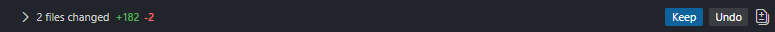
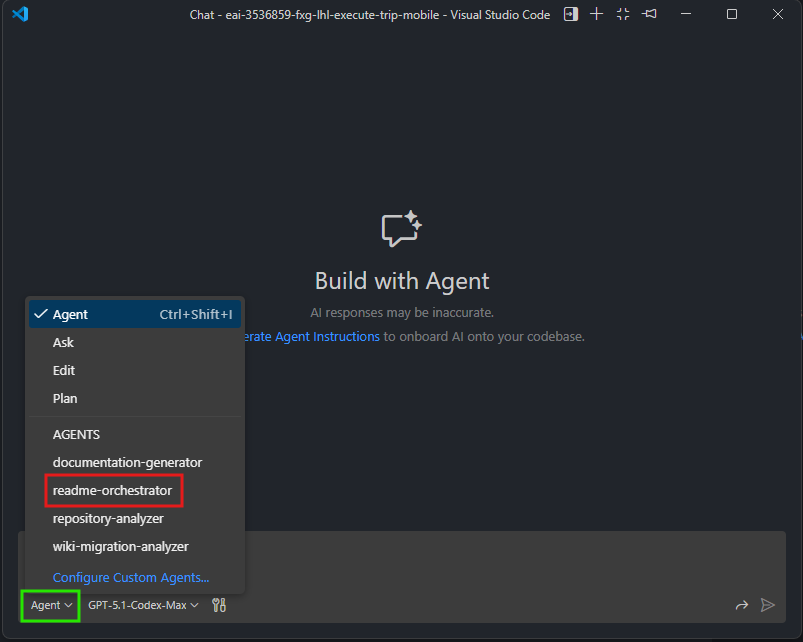
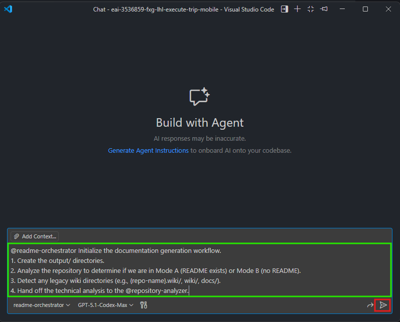
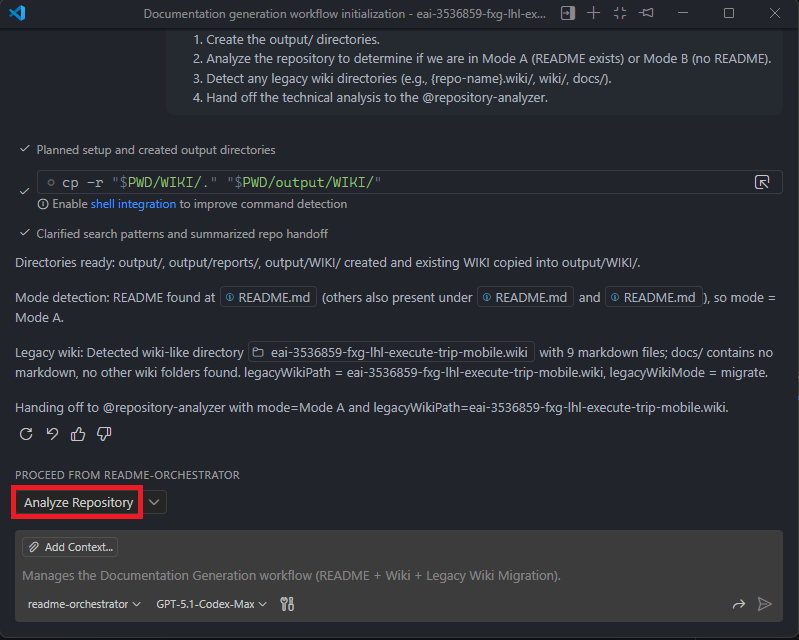
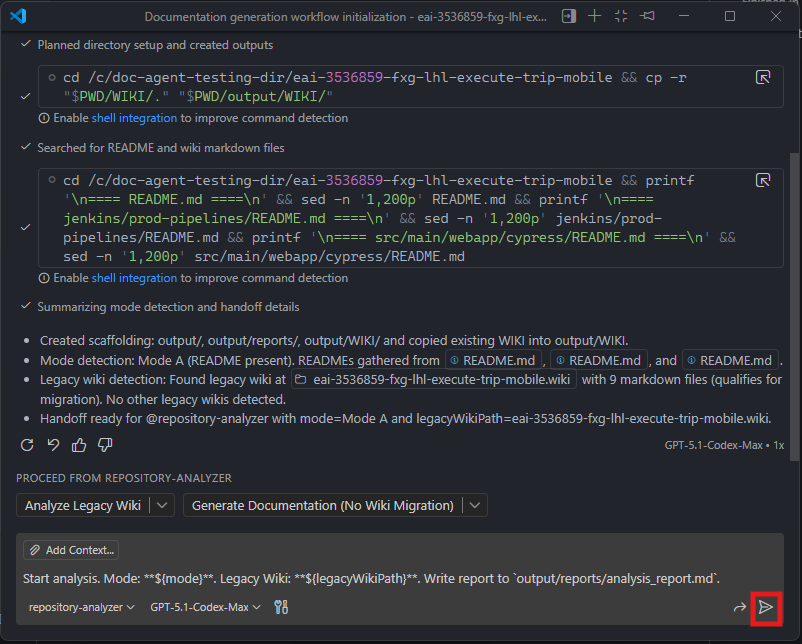
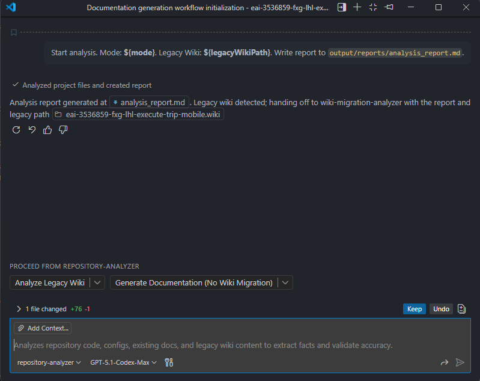
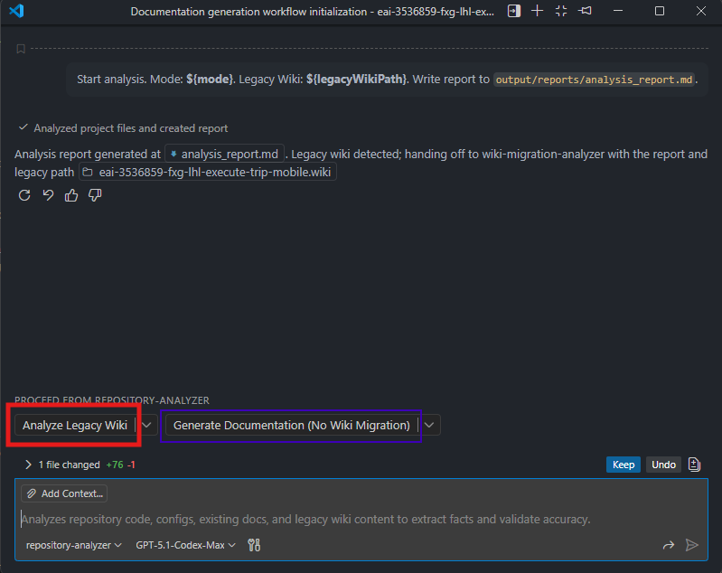
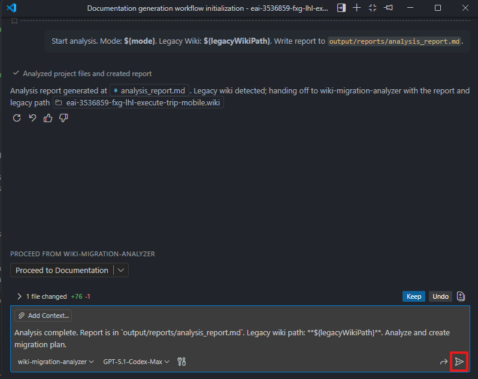
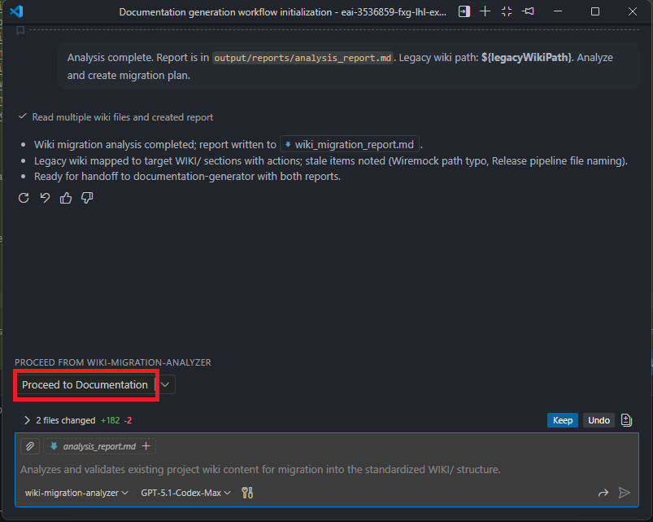
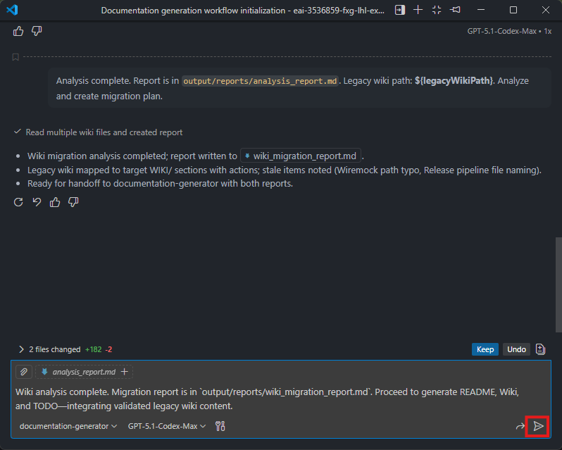

# Job Aid: Agentic Documentation Generator Workflow

Use this guide to set up and run the current 3-agent documentation workflow with the updated directory layout.

> [!CAUTION]
> **AI-Generated Content Disclaimer**
> 
> All documentation produced by this workflow is AI-generated and requires human review before publication. 
> You must validate all generated content for accuracy, completeness, and correctness. 
> AI can misinterpret code, omit critical details, or produce outdated information. Do not publish any generated documentation without a thorough review by a qualified team member.

## 1. Prerequisites

1. Github Copilot License - Free or Paid
2. Git / GitBash Installation
   - [Download Git-SCM](https://git-scm.com/downloads)
      - Standalone Installer : Git for Windows/x64 Setup.
3. Visual Studio Code
   - [Download Visual Studio Code](https://code.visualstudio.com/download)
4. Github Copilot Setup
   - [GitHub Copilot Setup Guide](https://code.visualstudio.com/docs/copilot/setup)

## 2. Application Setup

### Clone Repositories
- `target-repo`: The repository you want documentation generated for. Can also be referenced as `project root`

1. **Clone your target repository** locally.
   ```bash
   git clone <target-repo-url>
   ```

2. **Clone this repository** locally.
   ```bash
   git clone <agentic-doc-generator>
   ```
   
3. **(Optional) If a wiki exists**, clone your target wiki repository into the target repo locally.
   - Check if your target repo has a wiki by navigating to the "Wiki" tab on GitHub.
   - If a wiki exists, clone it so the agents can analyze and migrate the content.
   ```bash
   cd <target-repo>
   git clone <target-wiki-repo-url>
   # Example: git clone git@github.com:{owner}/{repo}.wiki.git
   ```
   > **Note:** The wiki repository is cloned as `{repo-name}.wiki/` inside your target repo. The agents detect this automatically during analysis.

### Copy Required Folders/Files

1. **Copy the agents folder** from `agentic-doc-generator/.github/agents/` into your target repo's `.github/agents/` directory.
   - If `.github/agents/` already exists, just copy over the `*.agent.md` files.
   - Copy all agent files (`.agent.md`)
    
   ```bash
   mkdir -p .github/agents
   cp -r <path-to-agentic-doc-generator>/.github/agents/* .github/agents/
   ```

2. **Copy the WIKI folder** from `agentic-doc-generator/WIKI/` to your target project's root.
   ```bash
   cp -r <path-to-agentic-doc-generator>/WIKI ./WIKI
   ```

3. **Copy the templates folder** from `agentic-doc-generator/templates/` to your target `project root`.
   ```bash
   cp -r <path-to-agentic-doc-generator>/templates ./templates
   ```

4. Open your project in VS Code and confirm the following structure exists:
   ```
   <your-repo>/ <-- root directory of target-repo
   ├── .github/
   │   └── agents/
   │       ├── AGENTS.md
   │       ├── readme-orchestrator.agent.md
   │       ├── repository-analyzer.agent.md
   │       ├── documentation-generator.agent.md
   │       └── wiki-migration-analyzer.agent.md
   │       
   ├── {repo-name}.wiki/ <-- If legacy wiki exists
   │       
   ├── templates/
   │   ├── README_TEMPLATE.md
   │   ├── TODO_TEMPLATE.md
   │   └── WIKI_TEMPLATE.md
   │       
   └── WIKI/
       ├── Home.md
       ├── 1-Architecture.md
       └── ...
   ```

#### Layout Reference

From the project root directory: 

| Path | Purpose |
|------|---------|
| `.github/agents/` | Core agents: `readme-orchestrator`, `repository-analyzer`, `documentation-generator`, `wiki-migration-analyzer` (archive of retired agents in `archive/`). |
| `templates/` | Strict templates: `README_TEMPLATE.md`, `TODO_TEMPLATE.md`, `WIKI_TEMPLATE.md`. |
| `WIKI/` | Starter wiki pages; `AGENTS.md` is for reference only. |
| `{repo-name}.wiki/` | (Optional) Cloned legacy wiki repository for migration. Only present if the target repo has an existing wiki. |
| `output/` | Created by the workflow: `reports/analysis_report.md`, `wiki_migration_report.md` (if legacy wiki exists), `README.md`, `TODO.md`, `WIKI/`. |

## 3. Execute Workflow

> Throughout the process, you might be requested to confirm tool/command executions by the agents. Please review and confirm as needed.
> 
> When asked to keep generated files, **review** changes first and then click the "Keep File" button as shown below:
> 


>[!TIP]
> Screenshot references are located in the `docs/` folder.
> When there are multi-colored boxes in a screenshot, green is the first step to take, followed by red.

1. Open the `target-repo` in VS Code.

2. Open Copilot Chat.

3. Select the `readme-orchestrator` agent in Copilot Chat's dropdown. (Red box in the bottom right, then green box to select the agent)

   

4. Paste the following prompt into Copilot Chat and submit:
   ```markdown
   @readme-orchestrator Initialize the documentation generation workflow.
   1. Create the output/ directories.
   2. Analyze the repository to determine if we are in Mode A (README exists) or Mode B (no README).
   3. Detect any legacy wiki directories (e.g., {repo-name}.wiki/, wiki/, docs/).
   4. Hand off the technical analysis to the @repository-analyzer.
   ```
   - The agent might show errors for creating the `/output` directory but should auto-correct.

   

5. Wait for the orchestrator to complete. It will hand off to the `repository-analyzer` agent.

   

6. Confirm the `repository-analyzer` agent prompt to initiate the analysis.

   

7. Wait for the analysis to complete.

   

8. If a legacy wiki is detected, confirm the `wiki-migration-analyzer` prompt when it appears.

   
> Select the purple box if no wiki migration is needed.
 
   

9. Wait for the wiki migration analysis to complete (if triggered).

   

10. Confirm the `documentation-generator` agent prompt to begin generating documentation.

   

11. Review the generated files and confirm to keep them.

   

> [!WARNING]
> Each agent requires confirmation before proceeding. Wait for the current agent to complete before confirming the next one. The final output files appear in the `output/` directory.

## 4. Review Generated Content

> [!IMPORTANT] 
> **Mandatory Review Checklist**
> 
> Before publishing any generated documentation, verify the following:
> - [ ] All code examples compile and run correctly
> - [ ] Version numbers, dependencies, and configurations match the actual codebase
> - [ ] API endpoints, parameters, and responses are accurate
> - [ ] Setup and installation instructions work as described
> - [ ] No sensitive information (secrets, credentials, internal URLs) is exposed
> - [ ] Technical claims align with the current implementation
> - [ ] Links and references point to valid resources

- Validate `output/reports/analysis_report.md` for mode selection and captured facts.
- Review `output/README.md`, `output/TODO.md`, and `output/WIKI/*.md` against the templates.

## 5. Wiki Deployment
Publish the wiki content by copying everything from `output/wiki/` (or if you just want the template; `WIKI/` starter set) into the repository's Wiki. 
- Skip `WIKI/AGENTS.md` -- it is meant to be LLM guidance only.

### How to clone a repository wiki
1. Navigate to your repository on GitHub.
2. Click on the "Wiki" tab.
3. On the right side, click on the "Clone this wiki locally" link to get the clone URL.
4. Open your terminal or command prompt.
5. Run the following command to clone the wiki repository:
   ```bash
   git clone <project-url>.wiki.git
   ```
Examples :
```bash
# SSH
   git clone git@github.com:{owner}/{repo}.wiki.git
# HTTPS
   git clone https://github.com/{owner}/{repo}.wiki.git
```

## 6. Cleanup
After you publish the generated docs, remove the `agentic-doc-generator` tooling if you do not plan to rerun it. Keep the final README and any wiki pages you deployed.

- Remove `{repo-name}.wiki` (if cloned)
- Remove `/output`
- Remove `/WIKI`
- Remove `/templates`
- Remove the agents within `.github/agents/` tied to this workflow
