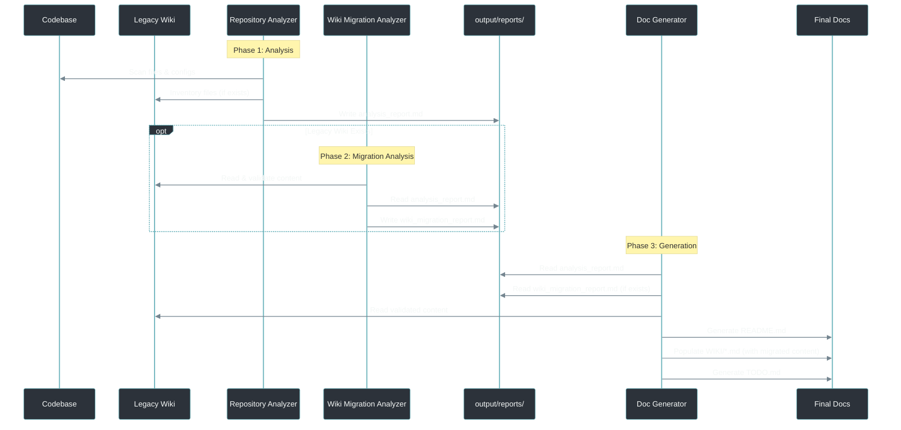

# Agentic Documentation Generation Process

## Executive Summary

This project implements an **Agentic Documentation Swarm**—a coordinated team of specialized AI agents designed to treat documentation as code. By automating the extraction, validation, and generation of technical documentation, we ensure that your `README.md` and Wiki remain "living documents" that accurately reflect the current state of your codebase.

**Value Proposition for IT Leaders:**
*   **Consistency:** Removes human error and stylistic variance from technical docs.
*   **Speed:** Generates comprehensive documentation suites in minutes, not days.
*   **Context-Optimized:** 3-4 agent architecture minimizes context window usage for Copilot compatibility.
*   **Standardization:** Enforces strict templates (`README_TEMPLATE.md`, `TODO_TEMPLATE.md`) automatically.
*   **Migration Support:** Automatically detects and migrates existing wiki content into the standardized structure.

---

## 2. High-Level Workflow

The process uses a streamlined 3-4 agent pipeline optimized for reduced context windows (e.g., GitHub Copilot). The wiki migration agent activates conditionally when legacy wiki content is detected.

```mermaid
graph LR
    %% Theme Definitions - Nordic Slate
    classDef manager fill:#2c323a,stroke:#62aeb7,stroke-width:3px,color:#f4f7f6
    classDef worker fill:#395671,stroke:#f4f7f6,stroke-width:2px,color:#f4f7f6
    classDef optional fill:#4a5568,stroke:#fbbf24,stroke-width:2px,stroke-dasharray: 3 3,color:#f4f7f6
    classDef artifact fill:#f4f7f6,stroke:#748590,stroke-width:2px,stroke-dasharray: 5 5,color:#2c323a
    classDef user fill:#62aeb7,stroke:#fff,stroke-width:2px,color:#fff

    User((User)) -->|Triggers| Orch["**Orchestrator**"]
    Orch -->|Handoff| Analyzer["**Repository Analyzer**"]
    Analyzer -->|Generates| Report[analysis_report.md]
    Analyzer -->|Legacy Wiki?| WikiMigrator["**Wiki Migration Analyzer**"]
    WikiMigrator -->|Generates| MigReport[wiki_migration_report.md]
    Report --> Generator["**Documentation Generator**"]
    MigReport -.-> Generator
    Generator -->|Generates| Outputs[README + Wiki + TODO]

    class Orch manager
    class Analyzer,Generator worker
    class WikiMigrator optional
    class Report,MigReport,Outputs artifact
    class User user
```



### Initial Prompt
```
@readme-orchestrator Initialize the documentation generation workflow. 
1. Create the `output/` directories.
2. Analyze the repository to determine if we are in "Greenfield" (New) or "Brownfield" (Migration) mode.
3. Detect any legacy wiki directories (e.g., wiki/, docs/, documentation/).
4. Hand off the technical analysis to the @repository-analyzer.
```

---

## 3. The Agent Squad

A lean 3-4 agent architecture optimized for Copilot's reduced context windows. The wiki migration agent is conditionally invoked when legacy wiki content is detected.

### 1. `readme-orchestrator` (The Project Manager)
*   **Role:** Workflow orchestration, state management, and wiki discovery.
*   **Responsibility:**
    *   Initializes the `output/` directories.
    *   Determines mode: **Mode A** (README exists) or **Mode B** (no README).
    *   **Detects legacy wiki directories** (e.g., `wiki/`, `docs/`, `documentation/`).
    *   Passes `${mode}` and `${legacyWikiPath}` to the Repository Analyzer.

### 2. `repository-analyzer` (The Systems Analyst + Auditor)
*   **Role:** Combined code analysis and documentation validation.
*   **Responsibility:**
    *   Scans repository for tech stack, dependencies, entry points, and build commands.
    *   **Mode A:** Validates existing README claims against codebase facts.
    *   **Mode B:** Extracts facts for new documentation.
    *   **Creates preliminary wiki inventory** if legacy wiki exists.
    *   **Output:** `output/reports/analysis_report.md` (concise ~50 lines with wiki inventory).
    *   **Routing:** Hands off to Wiki Migration Analyzer (if wiki) or Documentation Generator (if no wiki).

### 3. `wiki-migration-analyzer` (The Migration Specialist) ⚡ *Conditional*
*   **Role:** Legacy wiki analysis, validation, and migration planning.
*   **Responsibility:**
    *   Inventories all markdown files in the legacy wiki directory.
    *   **Validates content** against code facts from analysis report.
    *   **Maps legacy content** to the standardized WIKI/ structure.
    *   Identifies stale, outdated, or inaccurate content.
    *   **Output:** `output/reports/wiki_migration_report.md`.

### 4. `documentation-generator` (The Technical Writer)
*   **Role:** Synthesizes all documentation artifacts with optional migration integration.
*   **Responsibility:**
    *   Reads `analysis_report.md` and `wiki_migration_report.md` (if exists).
    *   **Integrates migrated wiki content** into target structure.
    *   Generates `output/README.md` using `templates/README_TEMPLATE.md`.
    *   Populates `output/WIKI/*.md` pages with migrated + new content.
    *   Creates `output/TODO.md` including migration gaps.
    *   **Outputs:** README, Wiki (with migrated content), TODO—all in one pass.

---

## 4. Data Flow Architecture

The system uses **intermediate report files** to minimize context consumption. The wiki migration phase is conditional.



---

## 5. Technical Implementation Details

*   **Context Storage:** Report files (`analysis_report.md`, `wiki_migration_report.md`) minimize context consumption.
*   **Context Savings:** 3-4 agents vs 6 = ~40% reduction in prompt loading.
*   **Conditional Routing:** Wiki migration agent only activates when legacy wiki is detected.
*   **Idempotency:** Generator fills placeholders without overwriting custom content.
*   **Strict Templates:**
    *   `README_TEMPLATE.md`: Structure for the main entry point.
    *   `TODO_TEMPLATE.md`: Structured gap analysis format.
    *   `WIKI_TEMPLATE.md`: Schema for detailed documentation.

### Legacy Wiki Detection Patterns

The orchestrator searches for these directory patterns (case-insensitive):

| Pattern | Description |
|---------|-------------|
| `wiki/` | Common wiki folder |
| `docs/wiki/` | Wiki nested in docs |
| `documentation/` | Full documentation folder |
| `.wiki/` | Hidden wiki folder |
| `docs/` | Docs with 3+ markdown files |
| `doc/` | Alternative docs folder |

### Migration Workflow

When a legacy wiki is detected:
1. **Inventory:** List all markdown files and infer topics from filenames.
2. **Validate:** Cross-reference content claims with actual code.
3. **Map:** Assign each file to a target section in `WIKI/`.
4. **Migrate:** Copy validated content, preserving attribution.
5. **Flag:** Add stale or conflicting content to `TODO.md` for review.

---

## 6. Archived Agents

The original 6-agent implementation is preserved in `agents/archive/` for reference:
- `readme-forensics-engineer.agent.md`
- `readme-quality-analyst.agent.md`
- `readme-dx-architect.agent.md`
- `wiki-content-expander.agent.md`
- `todo-manager.agent.md`

---

## 7. Wiki Migration Feature

### Overview

Projects often have existing documentation scattered across various wiki directories. This feature automatically:

1. **Discovers** legacy wiki directories in the project root.
2. **Analyzes** the content structure and validates accuracy against the codebase.
3. **Migrates** validated content into the standardized `WIKI/` structure.
4. **Preserves** source attribution for all migrated content.

### Content Transformation

| Legacy Format | Target Format |
|---------------|---------------|
| Bare headings | Heading with audience tag |
| Relative links | Wiki links (`[[PageName]]`) |
| External links | Preserved |
| Code blocks | Preserved with language hints |
| Diagrams | Preserved in appropriate section |

### Migration Rules

1. **Structure wins:** Legacy content adapts to target structure.
2. **Validate first:** Only validated content is migrated; stale content goes to TODO.
3. **No duplication:** Overlapping content is merged, not duplicated.
4. **Attribution:** All migrated content includes source file comments.
