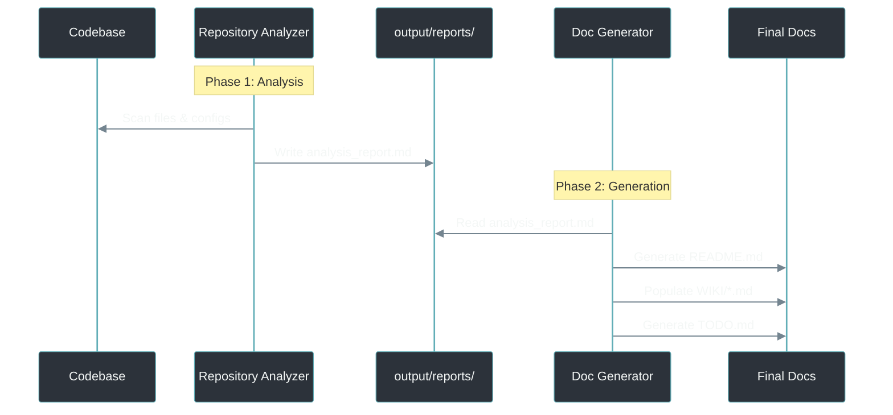

# Agentic Documentation Generation Process

## Executive Summary

This project implements an **Agentic Documentation Swarm**—a coordinated team of specialized AI agents designed to treat documentation as code. By automating the extraction, validation, and generation of technical documentation, we ensure that your `README.md` and Wiki remain "living documents" that accurately reflect the current state of your codebase.

**Value Proposition for IT Leaders:**
*   **Consistency:** Removes human error and stylistic variance from technical docs.
*   **Speed:** Generates comprehensive documentation suites in minutes, not days.
*   **Context-Optimized:** 3-agent architecture minimizes context window usage for Copilot compatibility.
*   **Standardization:** Enforces strict templates (`README_TEMPLATE.md`, `TODO_TEMPLATE.md`) automatically.

---

## 2. High-Level Workflow

The process uses a streamlined 3-agent pipeline optimized for reduced context windows (e.g., GitHub Copilot).

```mermaid
graph LR
    %% Theme Definitions - Nordic Slate
    classDef manager fill:#2c323a,stroke:#62aeb7,stroke-width:3px,color:#f4f7f6
    classDef worker fill:#395671,stroke:#f4f7f6,stroke-width:2px,color:#f4f7f6
    classDef artifact fill:#f4f7f6,stroke:#748590,stroke-width:2px,stroke-dasharray: 5 5,color:#2c323a
    classDef user fill:#62aeb7,stroke:#fff,stroke-width:2px,color:#fff

    User((User)) -->|Triggers| Orch["**Orchestrator**"]
    Orch -->|Handoff| Analyzer["**Repository Analyzer**"]
    Analyzer -->|Generates| Report[analysis_report.md]
    Report --> Generator["**Documentation Generator**"]
    Generator -->|Generates| Outputs[README + Wiki + TODO]

    class Orch manager
    class Analyzer,Generator worker
    class Report,Outputs artifact
    class User user
```



### Initial Prompt
```
@readme-orchestrator Initialize the documentation generation workflow. 
1. Create the `output/` directories.
2. Analyze the repository to determine if we are in "Greenfield" (New) or "Brownfield" (Migration) mode.
3. Hand off the technical analysis to the @repository-analyzer.
```

---

## 3. The Agent Squad

A lean 3-agent architecture optimized for Copilot's reduced context windows.

### 1. `readme-orchestrator` (The Project Manager)
*   **Role:** Workflow orchestration and state management.
*   **Responsibility:**
    *   Initializes the `output/` directories.
    *   Determines mode: **Mode A** (README exists) or **Mode B** (no README).
    *   Passes `${mode}` to the Repository Analyzer.

### 2. `repository-analyzer` (The Systems Analyst + Auditor)
*   **Role:** Combined code analysis and documentation validation.
*   **Responsibility:**
    *   Scans repository for tech stack, dependencies, entry points, and build commands.
    *   **Mode A:** Validates existing README claims against codebase facts.
    *   **Mode B:** Extracts facts for new documentation.
    *   **Output:** `output/reports/analysis_report.md` (concise ~40 lines).

### 3. `documentation-generator` (The Technical Writer)
*   **Role:** Synthesizes all documentation artifacts.
*   **Responsibility:**
    *   Reads `analysis_report.md` and strict templates.
    *   Generates `output/README.md` using `templates/README_TEMPLATE.md`.
    *   Populates `output/WIKI/*.md` pages.
    *   Creates `output/TODO.md` using `templates/TODO_TEMPLATE.md`.
    *   **Outputs:** README, Wiki, TODO—all in one pass.

---

## 4. Data Flow Architecture

The system uses a **single intermediate file** to minimize context consumption.



---

## 5. Technical Implementation Details

*   **Context Storage:** Single report file (`analysis_report.md`) replaces multiple intermediate files.
*   **Context Savings:** 3 agents vs 6 = ~40% reduction in prompt loading.
*   **Idempotency:** Generator fills placeholders without overwriting custom content.
*   **Strict Templates:**
    *   `README_TEMPLATE.md`: Structure for the main entry point.
    *   `TODO_TEMPLATE.md`: Structured gap analysis format.
    *   `WIKI_TEMPLATE.md`: Schema for detailed documentation.

---

## 6. Archived Agents

The original 6-agent implementation is preserved in `agents/archive/` for reference:
- `readme-forensics-engineer.agent.md`
- `readme-quality-analyst.agent.md`
- `readme-dx-architect.agent.md`
- `wiki-content-expander.agent.md`
- `todo-manager.agent.md`
