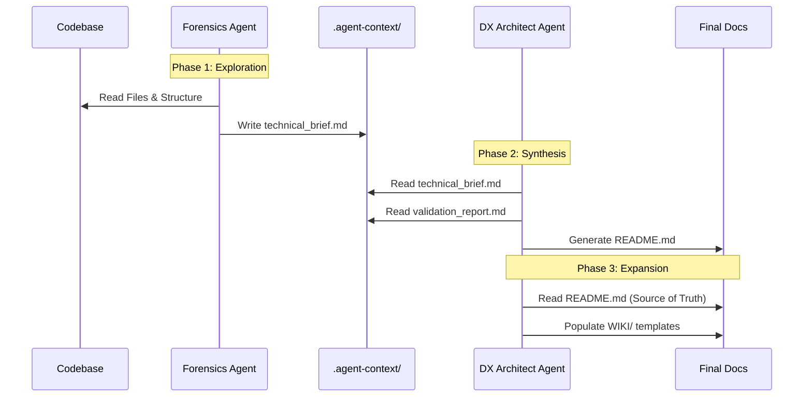

# Agentic Documentation Generation Process

## Executive Summary

This project implements an **Agentic Documentation Swarm**—a coordinated team of specialized AI agents designed to treat documentation as code. By automating the extraction, validation, and generation of technical documentation, we ensure that your `README.md` and Wiki remain "living documents" that accurately reflect the current state of your codebase.

**Value Proposition for IT Leaders:**
*   **Consistency:** Removes human error and stylistic variance from technical docs.
*   **Speed:** Generates comprehensive documentation suites in minutes, not days.
*   **Separation of Concerns:** Distinct agents handle fact-gathering (Forensics) versus presentation (DX), ensuring technical accuracy without sacrificing readability.
*   **Standardization:** Enforces strict templates (Conventional Commits, standardized READMEs) automatically.

---

## 2. High-Level Workflow

The process is orchestrated by a central manager agent that dispatches specialized workers in a strict linear pipeline. This ensures that downstream agents always have validated context from upstream analysis.

```mermaid
graph TD
    User((User)) -->|Triggers| Orch[**Readme Orchestrator**<br/>(Manager)]
    
    subgraph "Phase 1: Context & Fact Finding"
        Orch -->|Handoff| Forensics[**Forensics Engineer**<br/>(Analyst)]
        Forensics -->|Generates| Brief[Technical Brief]
    end

    subgraph "Phase 2: Validation"
        Brief --> QA[**Quality Analyst**<br/>(Auditor)]
        QA -->|Generates| Report[Validation Report]
    end

    subgraph "Phase 3: Execution & Generation"
        Report --> DX[**DX Architect**<br/>(Writer)]
        DX -->|Generates| README[docs/README.md]
        DX -->|Generates| TODO[TODO.md]
        
        README --> WikiExp[**Wiki Content Expander**<br/>(Tech Writer)]
        Brief --> WikiExp
        WikiExp -->|Populates| Wiki[WIKI/*.md]
    end

    style Orch fill:#f9f,stroke:#333,stroke-width:2px
    style README fill:#bbf,stroke:#333,stroke-width:2px
    style Wiki fill:#bbf,stroke:#333,stroke-width:2px
```

---

## 3. The Agent Squad

Each agent in this pipeline mimics a specific real-world role within a software development team.

### 1. `readme-orchestrator` (The Project Manager)
*   **Role:** Workflow orchestration and state management.
*   **Responsibility:**
    *   Initializes the `.agent-context/` workspace.
    *   Determines if the project is in "Greenfield" (Generation) or "Brownfield" (Migration) mode.
    *   Manages handoffs between agents to prevent context loss.

### 2. `readme-forensics-engineer` (The Systems Analyst)
*   **Role:** Deep code analysis and fact extraction.
*   **Responsibility:**
    *   Scans the entire repository to understand the tech stack, implementation details, and hidden logic.
    *   **Output:** `.agent-context/technical_brief.md` (Raw, unstructured technical facts).
    *   *Note: This agent does not write user-facing text; it only extracts truth.*

### 3. `readme-quality-analyst` (The Auditor)
*   **Role:** Verification and gap analysis.
*   **Responsibility:**
    *   Reviews the `technical_brief.md` against the codebase to ensure no hallucinations.
    *   Identifies missing sections or ambitious claims.
    *   **Output:** `.agent-context/validation_report.md` (A "pass/fail" report for the brief).

### 4. `readme-dx-architect` (The Technical Writer co. "DevRel")
*   **Role:** Synthesis and user-facing documentation.
*   **Responsibility:**
    *   Consumes the validated facts.
    *   Applies the `README_TEMPLATE.md` to ensure consistent formatting.
    *   Writes the "Selling Pitch" and "Getting Started" guides.
    *   **Output:** `docs/README.md` and `TODO.md`.

### 5. `wiki-content-expander` (The Operations Specialist)
*   **Role:** Detailed operational documentation.
*   **Responsibility:**
    *   Takes the high-level concepts from the README.
    *   Expands them into deep-dive articles in the `WIKI/` directory.
    *   Fills in structure templates with specific configuration, API details, and deployment steps.
    *   **Output:** Fully populated `WIKI/` directory (e.g., `1.1-System-Overview.md`, `4.1-API-Endpoints.md`).

---

## 4. Data Flow Architecture

The system relies on a **"Context Waterfall"** approach where information is refined at each step.



---

## 5. Technical Implementation Details

*   **Context Storage:** All intermediate state is stored in `.agent-context/`. This allow agents to "pass the baton" without needing massive context windows to remember the entire conversation history.
*   **Idempotency:** The Wiki Expander is designed to be safe to run multiple times; it looks for placeholders to fill rather than overwriting custom changes.
*   **Templates:**
    *   `README_TEMPLATE.md`: Enforces structure for the main entry point.
    *   `WIKI_TEMPLATE.md`: Defines the schema for the detailed documentation.
